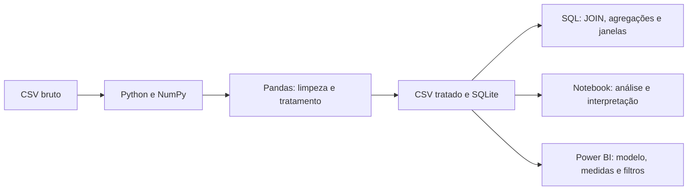
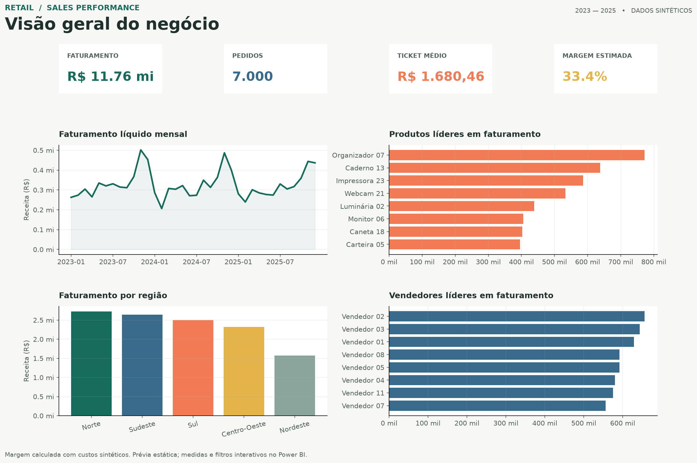

# Sales Data Analysis | Varejo

Projeto de portfólio de análise de dados ponta a ponta, com dados sintéticos de uma empresa varejista. O objetivo é demonstrar como transformar arquivos CSV em análises reproduzíveis e recomendações orientadas a perguntas de negócio, usando Python, SQL e Power BI.

## Contexto

A operação simulada vende produtos de cinco categorias em cinco regiões brasileiras, com múltiplos vendedores e clientes que podem fazer pedidos recorrentes. A base cobre janeiro de 2023 a dezembro de 2025. São **700 clientes, 60 produtos, 24 vendedores, 5 regiões, 7.000 pedidos e 14.094 itens de venda**. Os registros são gerados com semente fixa e não contêm dados pessoais reais.

## Perguntas de negócio

1. Qual é o faturamento líquido total e quantos pedidos foram realizados?
2. Como o faturamento varia mês a mês?
3. Qual é o ticket médio por pedido?
4. Quais produtos lideram em faturamento e unidades vendidas?
5. Quais regiões concentram mais receita?
6. Quais vendedores geram maior volume e faturamento?
7. Quais meses cresceram ou caíram em relação ao mês anterior?
8. Quantos clientes são recorrentes e qual sua contribuição?
9. Qual é a margem estimada por venda e categoria?
10. Quais categorias têm maior participação no faturamento?

As respostas são calculadas nos notebooks e nas consultas SQL, sempre com definição explícita da métrica. Gráficos apoiam a interpretação; não substituem a conclusão de negócio.

## Principais resultados

Com a semente `42`, a receita líquida é **R$ 11,76 milhões**, distribuída em 7.000 pedidos, com ticket médio de **R$ 1.680,46**. A região Norte lidera faturamento; o produto Organizador 07 e o Vendedor 02 aparecem no topo de seus rankings. **245 clientes (35%)** compraram mais de uma vez. Casa responde por **23,7% da receita** e também apresenta a maior margem estimada por categoria (**36,5%**). O maior crescimento mensal foi **49,1% em março de 2024** frente ao mês anterior.

Esses valores descrevem apenas a simulação atual; não são benchmarks de mercado.

## Pipeline



## Dataset

| Tabela | Grão | Campos de análise |
|---|---|---|
| `customers` | Um cliente | segmento, região e data de cadastro |
| `products` | Um produto | categoria, preço e custo unitário estimado |
| `sales` | Um item de pedido | data, pedido, quantidade, desconto, receita e margem |
| `sellers` | Um vendedor | região de cadastro e data de contratação |
| `regions` | Uma região | nome e macrorregião |

O ticket é calculado por `order_id` distinto, pois um pedido pode ter vários itens. A receita líquida subtrai descontos. A margem é estimada a partir de custos simulados e não representa lucro contábil.

## Metodologia

1. `src/generate_data.py` produz dados relacionais reproduzíveis em `data/raw/`.
2. `src/clean_data.py` padroniza textos, remove duplicatas, valida datas, descontos, quantidades e chaves, calcula receita líquida e margem estimada e carrega o SQLite.
3. `sql/schema.sql` define o modelo relacional; `sql/analysis_queries.sql` demonstra `JOIN`, `GROUP BY`, `HAVING`, CTE, funções de janela e subqueries.
4. Os notebooks apresentam perfil de qualidade, análises de negócio e visualizações interpretadas.
5. O guia Power BI descreve modelo estrela, medidas DAX, páginas e segmentadores para período, região e categoria.

## Começar

Requer Python 3.10 ou superior.

```bash
python -m venv .venv
source .venv/bin/activate
python -m pip install -r requirements.txt
python src/generate_data.py
python src/clean_data.py
python -m unittest discover -s tests -v
python src/create_dashboard_preview.py
```

Abra e execute os notebooks nesta ordem:

1. [01_data_generation.ipynb](01_data_generation.ipynb)
2. [02_data_cleaning.ipynb](02_data_cleaning.ipynb)
3. [03_exploratory_analysis.ipynb](03_exploratory_analysis.ipynb)

Os CSVs limpos e o banco SQLite são gravados em `data/processed/`. O banco pode ser recriado a qualquer momento com o comando de limpeza.

## Prévia do dashboard



A imagem é uma prévia estática feita com Matplotlib e dados do projeto. As instruções para montar a versão interativa no Power BI Desktop, com KPIs, evolução temporal, rankings e filtros, estão em [powerbi/README.md](powerbi/README.md), junto das [medidas DAX](powerbi/measures.dax) e do [tema](powerbi/retail_theme.json). Um arquivo `.pbix` não é incluído: a criação e captura do relatório interativo dependem do Power BI Desktop, indisponível neste ambiente Linux.

## Estrutura

```text
.
├── 01_data_generation.ipynb
├── 02_data_cleaning.ipynb
├── 03_exploratory_analysis.ipynb
├── data/
│   ├── raw/                 # CSVs sintéticos de origem
│   └── processed/           # CSVs tratados e banco SQLite recriável
├── powerbi/                 # Modelo, medidas DAX e tema
├── sql/                     # Esquema e consultas de análise
├── src/                     # Geração, limpeza e prévia estática
└── tests/                   # Testes de reprodutibilidade e qualidade
```

## Tecnologias

Python, Pandas, NumPy, SQLite, SQL, Matplotlib, Power BI e Jupyter Notebook.

## Limitações e próximos passos

Dados e custos são simulados; sazonalidade e resultados não devem ser interpretados como evidência de mercado real. Próximos passos: substituir a fonte sintética por dados autorizados, definir metas comerciais, validar custos reais e publicar o relatório `.pbix` com captura de tela após montagem no Power BI Desktop.
